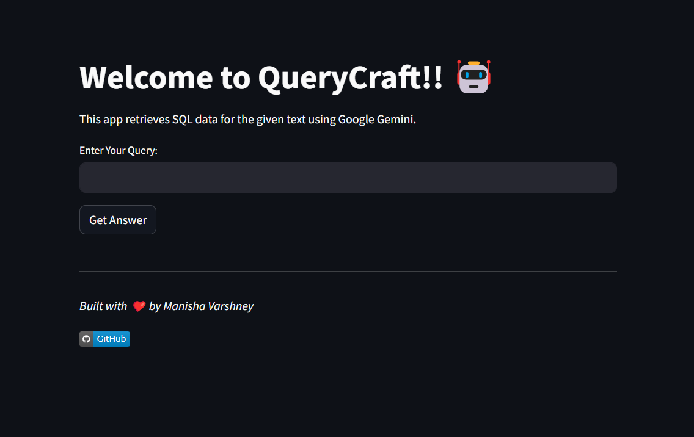

# SQL-LLM 

SQL LLM is a Streamlit application that utilizes Google Gemini's language model to convert natural language queries into SQL commands. This project is built using Python, Streamlit, and the Google Gemini API. The SQL LLM app can be accessed [here](https://sql-llm.streamlit.app/)

---

## Table Structure

The app uses a predefined table "students" stored in the "data.db" file with the following structure:

| Name     | Class   | Marks | Company   |
|----------|---------|-------|-----------|
| Manisha  | MCA     | 90    | Microsoft|
| HARSHIT  | BTech   | 80    | Qualcomm |
| Naren    | MSc     | 75    | Tractrix  |
| Gunjan   | Nursing | 82    | CHO      |
| Disha    | BCA     | 70    | BLC      |

---

## How It Works

1. **Input Query:** Users enter natural language questions, e.g., "Sort the students."
2. **Google Gemini Translation:** The app utilizes Google Gemini's language model to translate the query into a SQL command.
3. **SQL Query Execution:** The translated SQL query is executed on the pre-built table stored in "sql.py."
4. **Result Presentation:** The app dynamically displays the query results, providing an interactive demonstration of natural language to SQL conversion.

**Note:** If the input does not result in a valid SQL query, the app responds with "Enter valid input" to guide users towards proper query formulation.

---

## How to Run

1. Clone the repository:
   ```bash
   git clone https://github.com/manisha-v/SQL-LLM.git
   cd SQL-LLM
   ```
   
2. Install the dependencies
   ```bash
   pip install -r requirements.txt
   ```
   
3. Generate a Google Gemini API key and save it as `API_KEY` in your `secrets.toml` file.

4. If you want to use a different table or data then make changes in "sql.py" accordingly and run it:
   ```bash
   python sql.py
   ```

5. Run the "app.py" script:
   ```bash
   streamlit run app.py
   ```

6. Enjoy exploring natural language to SQL conversion and real-time query results!

---

## Preview

|  |
|----------|
|  |
|  |


---

## Deployment

The app has been deployed and is accessible through the following link: https://sql-llm.streamlit.app/

---

## Contact

I'm always open to new opportunities and collaborations. Feel free to reach out to me through the contact form on my [portfolio website](https://manisha-v.github.io/portfolio/) or via email at [varshney.manisha05@gmail.com](mailto:varshney.manisha05@gmailcom).

Connect me on [LinkedIn](https://www.linkedin.com/in/manisha-varshney-914646191/)  
